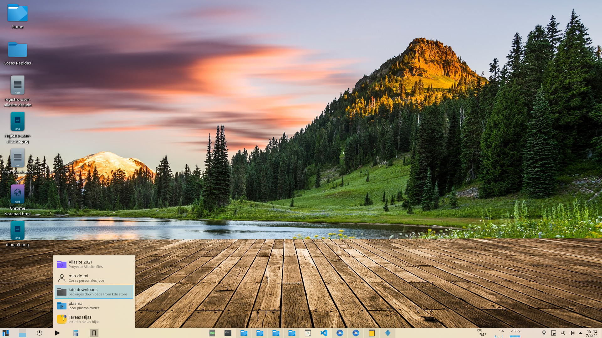

# plasma-applet-favoriteFolders

Plasma 5 widget that provides quick access to user-defined favorite folders.

Maybe there is a proper way to do this, but I didn't find a way to be able to have shortcuts to the folders I use most often .... I didn't want to clutter my desktop with links.


I tried the following great solutions, but they didn't satisfy the main goal
(to have a quick access to the folders I use the most at a given time):

* PlacesWidget: it shows Places and these must be configured from Dolphin but this made the dolphin sidebar to show more entries, also I think the concept of places
does not suit favorite folders
* FileDrawer : looked promising... but I could not configure it, as it froze the desktop,
but its function is to show the content of a given folder... then I should create a favorites folder and put links to my other folders.... might work but I couldn't configure it

* PlasmaFolderList: I think it is the one that has the exact functionality, but the installation was a bit complicated and its UI was not very functional (for my taste).

These are cool widgets and have specific purposes.

So inspired by them try to use their ideas and this widget was born.

## Screenshots




## Features

* I could add as many urls (folders) as you want.
* for each url (folder) I can define a short name, description and an icon
* I could sort the folders (manually)
* you can define an icon for the widget
* you can change the width of the dropdown


## A) Install via KDE

0. I still don't know how to gegerar in .plasmoid file... sorry
1. for now download the zipped file and unzip in ./local/share/plasma/plasmoids/

## B) Install via GitHub

```
still don't know how, sorry again
```
## TO-DO
- [x] add folders using a file selector
- [] create groups to be able to organize folders (e.g. work, hobbies, downloads, etc)
- [] implement tooltips for each folder... to show its location
- [] translate
- [] see what else can be done to improve usability


## THANKS

## A) FOR RELATED IDEAS
* [HESSIJAMES](https://store.kde.org/p/1084935/) for Places Widget 
* [MOOFANG](https://store.kde.org/p/1291753/) for File Drawer 
* [NARAKU](https://store.kde.org/p/1238798/) for Plasma Folderlist 

## B) FOR OR FOR IMPLEMENTATION (I don't know much about qml (actually I don't know anything, try to use parts and understand the following projects) )
* [DRIGLU4IT](https://store.kde.org/p/1313987/) for Advanced Radio Player  (to present and edit items and icon selector) .
It is a great project and the simplicity with which it was implemented makes that even without knowing anything about qml or plasmoids it is easy to realize the way to follow.

- [ZREN](https://store.kde.org/p/1160672/) for all its widgets especially for TiledMenu (to understand the structure of a widget)
and also for their [tutorials](https://zren.github.io/kde/docs/widget/#default-widgets)
That they are the only clear guide on plasmoid development (according to me) and by [library](https://github.com/Zren/plasma-applet-lib) (that I am trying to understand to create the plasmoid installer)
Which give a set of basic tools for all plasmoid.

By the way in the screenshots you can see the icon I use for tiledmenu.... It's a couple of icons that I'm creating for Tiledmenu and that modifying the LauncherIcon.qml file changes when you hover the mouse over it (I don't know how to do to see if this interests Zren).

AND THANK YOU VERY MUCH TO THIS GREAT COMMUNITY
